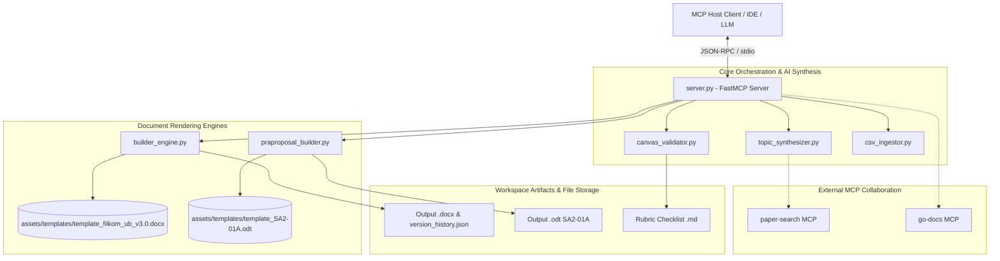

# 📖 Dokumentasi Teknis: Academic Proposal MCP Server

Dokumentasi arsitektur, spesifikasi modul, antarmuka Model Context Protocol (MCP), format dokumen, serta panduan implementasi teknis untuk **Academic Proposal MCP Server** (`academic-proposal-mcp`).

---

## 1. Ringkasan Eksekutif & Tujuan Sistem

**Academic Proposal MCP Server** adalah server mandiri (*standalone server*) berbasis **Model Context Protocol (MCP)** yang dirancang untuk mengotomatisasi seluruh siklus hidup penyusunan naskah akademik (khususnya proposal skripsi, tesis, dan formulir pra-proposal).

### 🎯 Tujuan Utama Sistem:
1. **Otomatisasi Komposisi Naskah**: Menghasilkan dokumen proposal 3 bab (`.docx`) dan formulir pra-proposal standar institusi (`.odt` SA2-01A) dengan struktur, tipografi, dan penomoran otomatis yang presisi.
2. **Validasi Metodologi & *Research Design Canvas***: Menegakkan kaidah penulisan ilmiah yang ketat (misal: 1 rumusan masalah terukur, identifikasi eksplisit variabel $X$ dan $Y$, tujuan linier, dan eliminasi klausa klise).
3. **Ingesti Matriks Literatur CSV**: Mengonversi dataset benchmark atau matriks telaah pustaka dari file CSV menjadi tabel perbandingan format formal dan daftar sitasi (Harvard / IEEE).
4. **Interoperabilitas Multi-MCP**: Berkolaborasi dengan MCP eksternal seperti `paper-search` (ArXiv, Semantic Scholar, Google Scholar, PubMed, OpenAlex) dan `go-docs` untuk *evidence-based research drafting*.
5. **Manajemen Versi Terstruktur**: Melacak riwayat revisi dokumen secara otomatis (`v1.0` $\rightarrow$ `v1.1` $\rightarrow$ `v2.0`) yang terdokumentasi dalam `version_history.json` dan menyediakan utilitas inspeksi struktur serta konversi ke Markdown.

---

## 2. Arsitektur Sistem & Alur Data

Sistem dibangun dengan arsitektur modular terpisah (*decoupled architecture*) di mana setiap modul bertanggung jawab atas satu domain logika tertentu.

### 📐 Diagram Arsitektur Komponen



---

## 3. Rincian Modul & Implementasi Teknis

### 3.1. `server.py` (FastMCP Host & Routing Interface)
- **Fungsi**: Entry point utama server MCP menggunakan framework `FastMCP`.
- **Fitur Utama**:
  - Mengonfigurasi `WORKSPACE_DIR` secara dinamis (default `/workspace` di container Docker atau direktori kerja lokal).
  - Mengekspos 13 MCP tools dan 2 panduan alur interaktif (*prompt templates*).
  - Mengimplementasikan alur konfirmasi data mahasiswa (*Data Verification Gate*). Jika metadata esensial (seperti Nama, NIM, Dosen Pembimbing) belum lengkap saat pemanggilan generator dokumen, sistem memberikan respons klarifikasi terstruktur sebelum meneruskan rendering dokumen.

### 3.2. `builder_engine.py` (Mesin Pembangun Dokumen DOCX)
- **Fungsi**: Membangun dokumen skripsi/tesis lengkap 3 Bab berbasis pustaka `python-docx` dan manipulasi OpenXML (`docx.oxml`).
- **Fitur & Mekanisme Teknis**:
  - **Heading Cleaners (`clean_heading_title`, `strip_list_prefix`)**: Mencegah redundansi nomor bab/subbab (seperti *"BAB 1 BAB 1: LATAR BELAKANG"* atau *"1.1 1.1 Latar Belakang"*) karena template Word telah memiliki skema multilevel numbering bawaan.
  - **Formatting & Page Setup**:
    - Margin: Kiri 4 cm (1.57 inci), Kanan 3 cm (1.18 inci), Atas 4 cm, Bawah 3 cm.
    - Spasi Paragraf: Line spacing 1.5 baris, spasi setelah paragraf 6 pt.
    - Penataan Heading: `keep_with_next = True` untuk mencegah *orphan headings* di akhir halaman.
  - **Tabel & Matrix Styling (`set_cell_margins`, `set_table_borders`)**: Menerapkan batas tabel standar (garis tunggal hitam 0.5 pt), *header repeat across pages*, dan padding sel yang konsisten.
  - **Pelacakan Versi (`record_version_change`, `increment_version`)**: Menyimpan histori revisi dokumen ke dalam `version_history.json`.
  - **Inspeksi Dokumen (`inspect_doc`)**: Melakukan audit struktural naskah (menghitung jumlah kata, paragraf, tabel, pohon hierarki heading, serta deteksi placeholder).
  - **Konversi ke Markdown (`export_docx_to_markdown`)**: Mengekstrak teks, heading bertingkat, dan tabel dari `.docx` ke format Markdown bersih untuk evaluasi cepat LLM.

### 3.3. `praproposal_builder.py` (Mesin Pembangun & Inspeksi Dokumen ODT SA2-01A)
- **Fungsi**: Mengisi, memodifikasi, mengekstrak, dan menginspeksi formulir pra-proposal standar institusi (format SA2-01A) dalam format OpenDocument Text (`.odt`).
- **Mekanisme Teknis**:
  - Mengoperasikan arsip zip `.odt` dan memanipulasi `content.xml` secara langsung menggunakan `xml.etree.ElementTree`.
  - Mengelola deklarasi *XML Namespaces* standar OASIS OpenDocument (`office`, `text`, `table`, `style`, dll.).
  - Mendeteksi sel tabel target berdasarkan label kunci (*Nama Mahasiswa, NIM, Departemen, Program Studi, Judul/Topik, Deskripsi Masalah, dll.*) dan mengganti konten paragraf (`text:p`) dengan mempertahankan style visual asli template.
  - Mendukung ekstraksi naskah (`extract_praproposal_from_odt`) dan inspeksi diagnostik batasan alokasi kata (`inspect_praproposal_odt`).

### 3.4. `canvas_validator.py` (Validator Metodologi & Research Design Canvas)
- **Fungsi**: Mengaudit kepatuhan naskah proposal 3 Bab (`.docx`) dan pra-proposal (`.odt` SA2-01A) terhadap kaidah ilmiah standar *Research Design Model Canvas v2.0*.
- **Aturan Validasi Kunci Proposal (3 Bab)**:
  - `[CLB04-01] Single Problem Formulation`: Memastikan hanya terdapat tepat 1 rumusan masalah terukur (mencegah pertanyaan majemuk/jamak).
  - `[CLB04-02] Formulation Quality`: Memvalidasi bahwa pertanyaan penelitian diawali dengan frasa evaluasi terukur (misal: *"Sejauh manakah...", "Bagaimanakah tingkat efektivitas..."*) dan bukan pertanyaan kualitatif deskriptif terbuka.
  - `[CLB04-02 / CLB04-03] Explicit X & Y Variables`: Memvalidasi keberadaan variabel independen ($X$) dan variabel dependen ($Y$).
  - `[CLB05-01] Aligned Objectives`: Memastikan tujuan penelitian berorientasi pada pengujian capaian empiris variabel.
  - `[CLB06-01 / CLB06-02] Actionable Benefits`: Mendeteksi dan menolak klausa administratif klise (*"syarat kelulusan", "menambah wawasan"*), mewajibkan manfaat konkret bagi pemangku kepentingan.
- **Aturan Validasi Khusus Pra-Proposal SA2-01A (`check_praproposal_canvas`)**:
  - `[PRA-LB01] Problem Description Budget`: Maksimal $\le 500$ kata.
  - `[PRA-LR01] Literature Review Budget`: Maksimal $\le 250$ kata.
  - `[PRA-MET01] Methodology Budget`: Maksimal $\le 250$ kata.
  - `[PRA-RM01 & PRA-RM02] Single Measurable Question`: Tepat 1 rumusan masalah terukur.
  - `[PRA-VAR01 & PRA-VAR02] Explicit X & Y`: Variabel perlakuan/metode ($X$) dan parameter metrik keberhasilan ($Y$).
  - `[PRA-META01 - PRA-META03] Student & Topic Identity`: Verifikasi integritas identitas mahasiswa dan usulan.
  - `[PRA-REF01] Bibliography Quality`: Ketersediaan daftar referensi ilmiah yang memadai.
- **Generator Laporan Audit (`generate_markdown_checklist_report`, `generate_praproposal_rubric_checklist_report`)**: Menghasilkan berkas laporan audit kepatuhan lengkap dalam format Markdown tabel matriks.

### 3.5. `csv_ingestor.py` (Parser & Ingestor Matriks Pustaka CSV)
- **Fungsi**: Membaca file CSV literatur / dataset benchmark dan mengonversinya menjadi elemen proposal.
- **Mekanisme Teknis**:
  - Dilengkapi *CSV Delimiter Sniffer* otomatis (mengenali koma `,`, titik koma `;`, pipa `|`, dan tab `\t`).
  - Pemetaan kolom cerdas (*fuzzy column finder*) untuk mendeteksi variasi nama kolom seperti *Penulis / Author, Tahun / Year, Judul / Title, Metode / Algoritma, Hasil / Metric, Kelemahan / Gap*.
  - Menghasilkan struktur output berupa tabel perbandingan untuk Bab 2, ringkasan naratif sintesis per studi, dan daftar pustaka standar.

### 3.6. `topic_synthesizer.py` (Sintesis & Perancangan Riset AI Berbasis Artefak)
- **Fungsi**: Mentransformasikan ide mentah atau berbagai artefak dunia nyata (artikel berita, dokumen masalah, rekaman kasus lapangan, deskripsi/OCR citra) menjadi usulan topik penelitian ilmiah komprehensif yang selaras dengan *Research Design Model Canvas*.
- **Fitur Utama**:
  - `generate_topic_from_artefact`: Menghasilkan paket usulan lengkap meliputi Judul Akademik (Indonesia & English), Urgensi Penelitian (Latar Belakang Fenomena, Urgensi Teknis/Teoretis, Dampak Risiko), Rumusan Masalah Tunggal Terukur, Variabel $X$ & $Y$, Tujuan (Umum & Khusus), Manfaat Bebas Klise, Batasan Masalah, serta Audit Kepatuhan Canvas otomatis.
  - `plan_research`: Menganalisis topik untuk menurunkan variabel $X$ dan $Y$, rumusan masalah tunggal, serta kata kunci pencarian akademik untuk diteruskan ke MCP `paper-search`.
  - `synthesize_proposal_from_inputs`: Membangun draf lengkap Bab 1 (Latar Belakang, Rumusan Masalah, Tujuan Umum & Khusus, Manfaat, Batasan), Bab 2 (Landasan Teori, Telaah Pustaka Komparatif), dan Bab 3 (Alur Penelitian, Pengumpulan Data, Perancangan Solusi, Pengujian & Metrik Evaluasi).
### 3.7. `diagram_generator.py` (Mesin Pembuat Diagram Ilmiah & Manajemen Asset)
- **Fungsi**: Merender gambar diagram ilmiah beresolusi tinggi (300 DPI) ke dalam folder `/asset` di workspace dan menyisipkannya ke dokumen proposal.
- **Tipe Diagram**:
  - *Flowchart Alur Penelitian*: Diagram vertikal alur tahapan riset (Tahap 1 s.d. 5) dengan rounded card dan directional arrow.
  - *Kerangka Konseptual ($X \rightarrow Y$)*: Visualisasi hubungan kausal variabel bebas ($X$), variabel terikat ($Y$), dan intervensi metode.
  - *Arsitektur Sistem (Layered)*: Diagram bertingkat multi-layer untuk arsitektur software/IoT/ML.

### 3.8. `formula_generator.py` (Mesin Render Rumus Matematika & Persamaan Akademik)
- **Fungsi**: Merender ekspresi matematika berbasis notasi LaTeX math menjadi gambar PNG transparan beresolusi tinggi (300 DPI), menyimpannya ke dalam direktori `/asset` di workspace, dan menyisipkannya ke dalam naskah proposal DOCX.
- **Standar Tata Letak Persamaan Akademik**:
  - Menggunakan tabel 1 baris $\times$ 2 kolom borderless:
    - **Kolom Kiri (5.2 inci)**: Menampung citra rumus matematika dengan perataan tengah (*Center*).
    - **Kolom Kanan (0.8 inci)**: Menampung label nomor persamaan resmi `(X.Y)` dengan perataan kanan (*Right*).
  - Dilengkapi blok keterangan simbol variabel (*"di mana: ... "*) dengan format baris bertakuk (*hanging indent*) dan simbol variabel miring (*italic*).
  - Mendukung sintesis rumus kompleks (pecahan `\frac`, notasi sigma `\sum`, integral `\int`, fungsi aktivasi `\sigma`, matriks/vektor, akar `\sqrt`, dan huruf Yunani `\alpha, \beta, \gamma, \theta`).

---

## 4. Daftar & Spesifikasi MCP Tools

| Nama Tool | Deskripsi | Parameter Utama | Output |
| :--- | :--- | :--- | :--- |
| `generate_topic_from_artefact` | Menghasilkan usulan topik penelitian ilmiah komprehensif (Judul, Urgensi, Rumusan Masalah, Variabel X/Y, Tujuan, Manfaat, dan Audit Canvas) berbasis artefak (berita, dokumen, cerita kasus, deskripsi citra/OCR). | `artefact_content`, `artefact_type`, `artefact_title`, `bidang_kajian`, `proposed_method_or_x`, `target_metric_or_y`, `institutional_focus` | Paket usulan topik, urgensi 3-dimensi, rumusan masalah tunggal terukur, variabel, tujuan, manfaat, audit canvas (100%), kueri paper-search |
| `generate_math_formula_image` | Merender rumus matematika LaTeX ke citra PNG transparan (300 DPI) di `/asset`, dengan penomoran resmi `(X.Y)` dan opsi langsung disisipkan ke naskah proposal DOCX. | `latex_code`, `formula_title`, `chapter_num`, `formula_num`, `variable_definitions`, `asset_folder`, `target_document_docx` | Status, nomor persamaan `(X.Y)`, path di `/asset`, info penyisipan |
| `insert_math_formula_to_document` | Menyisipkan citra rumus matematika dari `/asset` ke dalam naskah proposal DOCX dengan layout tabel borderless dan keterangan variabel. | `document_filename`, `image_filename_or_path`, `chapter_num`, `formula_num`, `intro_text`, `variable_definitions` | Status, path dokumen, nomor persamaan |
| `generate_diagram_image` | Menghasilkan gambar diagram (Flowchart, Kerangka Konseptual, Arsitektur), memastikan folder `/asset` dibuat, dan dapat langsung menyisipkan ke dokumen DOCX. | `diagram_type`, `title`, `steps_or_nodes`, `variabel_x`, `variabel_y`, `asset_folder`, `target_document_docx` | Status, path berkas di `/asset`, info penyisipan dokumen |
| `insert_diagram_to_document` | Menyisipkan file gambar diagram dari folder `/asset` ke dalam dokumen proposal DOCX dengan caption resmi (`Gambar X.Y <Judul>`). | `document_filename`, `image_filename_or_path`, `caption_title`, `chapter_num`, `figure_num` | Status, path file, nomor caption |
| `generate_praproposal_from_topic` | Menghasilkan formulir pra-proposal `.odt` (SA2-01A) langsung dari topik, data mahasiswa, CSV, atau hasil paper-search beserta validasi canvas otomatis. | `topic`, `variabel_x`, `variabel_y`, `student_metadata`, `csv_filename`, `retrieved_papers`, `output_filename` | Status, path berkas `.odt`, canvas compliance, ringkasan bagian |
| `generate_academic_praproposal` | Menyusun dokumen pra-proposal `.odt` dari struktur metadata dan sections eksplisit disertai audit canvas otomatis. | `metadata`, `sections`, `output_filename` | Status, path berkas `.odt`, canvas compliance |
| `validate_praproposal_compliance` | Memvalidasi naskah pra-proposal (SA2-01A) terhadap batasan alokasi kata dan Research Canvas (dapat memvalidasi dari payload atau berkas `.odt`). | `metadata`, `sections`, `odt_filename`, `variabel_independen`, `variabel_dependen`, `single_problem_only` | Status (`APPROVED`/`NEEDS_REVISION`), skor kepatuhan (%), budget kata, daftar pelanggaran |
| `generate_praproposal_rubric_report` | Menghasilkan laporan audit checklist kepatuhan formulir pra-proposal (SA2-01A) dalam format Markdown. | `proposal_title`, `student_name`, `student_id`, `metadata`, `sections`, `odt_filename`, `variabel_independen`, `variabel_dependen`, `output_markdown_filename` | Status, path berkas `.md`, teks laporan audit |
| `validate_canvas_compliance` | Mengaudit ketelitian metodologi proposal 3 Bab terhadap aturan Research Canvas. | `rumusan_masalah`, `variabel_independen`, `variabel_dependen`, `tujuan_penelitian`, `manfaat_penelitian`, `single_problem_only` | Status (`APPROVED`/`NEEDS_REVISION`), skor kepatuhan (%), daftar lolos, daftar pelanggaran |
| `generate_rubric_checklist_report` | Membuat file audit checklist evaluasi proposal DOCX lengkap dalam format Markdown. | `proposal_title`, `student_name`, `student_id`, `rumusan_masalah`, `variabel_independen`, `variabel_dependen`, `tujuan_penelitian`, `manfaat_penelitian`, `output_markdown_filename` | Status, path file `.md`, ringkasan audit |
| `get_canvas_guidelines` | Mengambil seluruh rubrik, definisi kode pelanggaran, dan checklist metodologi (termasuk rubrik pra-proposal). | *(tanpa parameter)* | Dictionary rubrik Bab 1, 2, 3, dan SA2-01A |
| `generate_proposal_from_topic` | Menghasilkan proposal 3 Bab `.docx` lengkap dari topik, variabel, CSV, dan paper-search beserta diagram alur riset otomatis. | `topic`, `variabel_x`, `variabel_y`, `student_metadata`, `csv_filename`, `retrieved_papers`, `output_filename` | Status, path berkas `.docx`, ringkasan bab |
| `generate_academic_proposal` | Menyusun dokumen proposal `.docx` dari data Bab 1, Bab 2, Bab 3, dan referensi yang sudah terstruktur. | `metadata`, `bab1_data`, `bab2_subbab`, `bab3_subbab`, `daftar_referensi`, `output_filename` | Status, path berkas `.docx`, jumlah halaman/paragraf |
| `plan_proposal_research` | Merancang dekomposisi variabel dan query pencarian literatur akademik. | `topic`, `bidang_kajian`, `variabel_x`, `variabel_y` | Variabel $X$/$Y$, rumusan masalah terukur, query `paper-search` |
| `parse_literature_csv_data` | Mem-parsing file CSV literatur menjadi tabel matriks dan daftar pustaka. | `csv_filename`, `csv_content` | Matriks tabel Bab 2, daftar referensi, paragraf sintesis |
| `inspect_proposal_document` | Menganalisis kesehatan struktur naskah dokumen proposal (`.docx` maupun `.odt`). | `filename` (default: `"Proposal Skripsi v1.0.docx"`) | Jumlah kata/paragraf/tabel, budget compliance kata, heading tree |
| `increment_proposal_version` | Menduplikasi proposal DOCX ke versi baru dan mencatat riwayat perubahan. | `current_version`, `new_version`, `changelog` | Status, nama file baru, rekaman `version_history.json` |
| `increment_praproposal_version` | Menduplikasi pra-proposal ODT ke versi baru dan mencatat riwayat perubahan. | `current_version`, `new_version`, `changelog`, `filename_prefix` | Status, nama file baru, rekaman `version_history.json` |
| `export_proposal_as_markdown` | Mengonversi dokumen proposal DOCX menjadi Markdown bersih. | `filename` | Teks Markdown terstruktur dari proposal |

---

## 5. Standar Dokumen & Aset Template

Proyek ini menyertakan template bawaan di dalam folder `assets/`:

1. `assets/templates/template_filkom_ub_v3.0.docx`:
   - Template resmi naskah proposal skripsi dengan styling:
     - *Heading 1*: Huruf Kapital, Tengah, Bold, Page Break otomatis.
     - *Heading 2 & Heading 3*: Multilevel numbering otomatis (`1.1`, `1.1.1`).
     - Font standar Times New Roman 12 pt, spasi 1.5, perataan justify.
2. `assets/templates/template_SA2-01A.odt`:
   - Formulir standar Pengajuan Pra-Proposal Skripsi (SA2-01A) berisi tabel identitas mahasiswa, judul/topik, deskripsi masalah, telaah pustaka terkait, rencana metodologi, dan daftar pustaka.
3. `assets/frameworks/research_canvas_v2.0.docx`:
   - Dokumen acuan standar *Research Design Model Canvas* untuk validasi metodologi kuantitatif dan *Design Science Research Methodology (DSRM)*.

---

## 6. Alur Integrasi & Skenario Penggunaan

### Skenario A: Penyusunan Pra-Proposal SA2-01A (End-to-End)
1. **Perencanaan & Query**: Jalankan `plan_proposal_research` untuk mengidentifikasi variabel $X$, $Y$, dan kata kunci pencarian.
2. **Pencarian Literatur**: Gunakan MCP `paper-search` (`search_arxiv`, `search_semantic`) untuk mengumpulkan 3-5 paper acuan utama.
3. **Konfirmasi Metadata**: Pastikan metadata mahasiswa (*Nama, NIM, Departemen, Program Studi, Dosen Pembimbing*) telah diverifikasi.
4. **Generasi Pra-Proposal**: Panggil `generate_praproposal_from_topic` untuk menghasilkan dokumen `Praproposal_SA2-01A_[NIM]_[Nama].odt`.
5. **Audit Metodologi**: Jalankan `validate_canvas_compliance` atau `generate_rubric_checklist_report` untuk memastikan kepatuhan canvas.

### Skenario B: Penyusunan Proposal Skripsi 3 Bab Lengkap (DOCX)
1. **Ingesti CSV (Opsional)**: Jika memiliki matriks pustaka atau dataset, proses dengan `parse_literature_csv_data`.
2. **Generasi Proposal**: Panggil `generate_proposal_from_topic` atau `generate_academic_proposal`.
3. **Inspeksi Naskah**: Panggil `inspect_proposal_document` untuk memverifikasi pohon heading, keterisian paragraf, dan ketiadaan teks placeholder.
4. **Versioning & Ekspor**: Setelah revisi dilakukan, gunakan `increment_proposal_version` untuk memperbarui versi (`v1.0` $\rightarrow$ `v1.1`) dan `export_proposal_as_markdown` untuk analisis naskah berbasis teks.

---

## 7. Panduan Instalasi & Konfigurasi

### 7.1. Menggunakan Docker (Rekomendasi Produksi)

```bash
# 1. Clone repository
git clone https://github.com/ranoes/academic-mcp-proposal.git
cd academic-mcp-proposal

# 2. Build Docker Image
docker build -t academic-proposal-mcp:latest .
```

Tambahkan pada konfigurasi MCP client (misal: `mcp_config.json`):
```json
{
  "mcpServers": {
    "academic-proposal-mcp": {
      "command": "docker",
      "args": [
        "run",
        "-i",
        "--rm",
        "-v",
        ".:/workspace",
        "academic-proposal-mcp:latest"
      ]
    }
  }
}
```

### 7.2. Menjalankan Langsung via Python / UV

```bash
# 1. Pasang dependensi
pip install -r requirements.txt
pip install -e .

# 2. Jalankan server
python server.py
```

Konfigurasi MCP client untuk Python lokal:
```json
{
  "mcpServers": {
    "academic-proposal-mcp": {
      "command": "python",
      "args": ["${workspaceFolder}/server.py"],
      "env": {
        "WORKSPACE_DIR": "${workspaceFolder}"
      }
    }
  }
}
```

---

## 8. Ringkasan Ketergantungan (Dependencies)

- `python-docx` ($\ge 1.1.2$): Manipulasi dokumen DOCX dan elemen XML WordprocessingML.
- `mcp` ($\ge 1.3.0$): Implementasi Model Context Protocol server.
- `odfpy` ($\ge 1.4.1$): Penanganan dan inspeksi dokumen OpenDocument.
- `xml.etree.ElementTree` & `zipfile`: Pustaka standar Python untuk modifikasi template `.odt`.
- `csv` & `io`: Parser berkas CSV dan sniffer dialek data.

---
*Dokumentasi ini dibuat sebagai referensi teknis komprehensif arsitektur dan kapabilitas sistem Academic Proposal MCP Server.*
